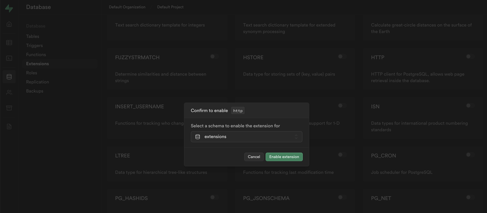

# App Platform with Self-Hosted Supabase

## Introduction

This repository contains an example of how to easily and quickly deploy an application on to DigitalOcean via [App Platform](https://www.digitalocean.com/products/app-platform) with a self-hosted Supabase instance also running on DigitalOcean as describe [here](https://docs.digitalocean.com/developer-center/hosting-supabase-on-digitalocean).

The focus of this repository is to deploy the following resources:

<div style="text-align: center;">


</div>

The application is a simple user management app [(taken from the Supabase web app tutorials)](https://supabase.com/docs/guides/getting-started/tutorials/with-react) written in React.

With our final architecture looking like so:


## Requirements

* A self-hosted Supabase instance as described [here](https://github.com/digitalocean/supabase-on-do).

## Database Schema Set Up

Before deploying the application we need to set up the database schema. Copy the following SQL and paste it in the SQL Editor within your Supabase instance.

<details>
<summary>User Management SQL</summary>

```sql
-- Create a table for public profiles
create table profiles (
  id uuid references auth.users not null primary key,
  updated_at timestamp with time zone,
  username text unique,
  full_name text,
  avatar_url text,
  website text,

  constraint username_length check (char_length(username) >= 3)
);
-- Set up Row Level Security (RLS)
-- See https://supabase.com/docs/guides/auth/row-level-security for more details.
alter table profiles
  enable row level security;

create policy "Public profiles are viewable by everyone." on profiles
  for select using (true);

create policy "Users can insert their own profile." on profiles
  for insert with check (auth.uid() = id);

create policy "Users can update own profile." on profiles
  for update using (auth.uid() = id);

-- This trigger automatically creates a profile entry when a new user signs up via Supabase Auth.
-- See https://supabase.com/docs/guides/auth/managing-user-data#using-triggers for more details.
create function public.handle_new_user()
returns trigger as $$
begin
  insert into public.profiles (id, full_name, avatar_url)
  values (new.id, new.raw_user_meta_data->>'full_name', new.raw_user_meta_data->>'avatar_url');
  return new;
end;
$$ language plpgsql security definer;
create trigger on_auth_user_created
  after insert on auth.users
  for each row execute procedure public.handle_new_user();

-- Set up Storage!
insert into storage.buckets (id, name)
  values ('avatars', 'avatars');

-- Set up access controls for storage.
-- See https://supabase.com/docs/guides/storage#policy-examples for more details.
create policy "Avatar images are publicly accessible." on storage.objects
  for select using (bucket_id = 'avatars');

create policy "Anyone can upload an avatar." on storage.objects
  for insert with check (bucket_id = 'avatars');

create policy "Anyone can update their own avatar." on storage.objects
  for update using (auth.uid() = owner) with check (bucket_id = 'avatars');
```

</details>

### Storage Management

To efficiently use our [Spaces bucket](https://www.digitalocean.com/products/spaces) we will allow database triggers to remove obsolete objects.

First thing to do is enable the `http` extension for the `extension` schema in the Supabase Dashboard as shown below.

<div style="text-align: center;">





</div>

 Then, define the following SQL functions in the SQL Editor to delete storage objects via the API. _N.B._ Replace the variables `<YOURPROJECTURL>` and `<YOURSERVICEROLEKEY>` with your information.

<details>
<summary>Delete Object Storage</summary>

```sql
create or replace function delete_storage_object(bucket text, object text, out status int, out content varchar)
returns record
language 'plpgsql'
security definer
as $$
declare
  project_url varchar := '<YOURPROJECTURL>';
  service_role_key varchar := '<YOURSERVICEROLEKEY>'; --  full access needed
  url varchar := project_url||'/storage/v1/object/'||bucket||'/'||object;
begin
  select
      into status, content
           result.status::int, result.content::varchar
      FROM extensions.http((
    'DELETE',
    url,
    ARRAY[extensions.http_header('authorization','Bearer '||service_role_key)],
    NULL,
    NULL)::extensions.http_request) as result;
end;
$$;

create or replace function delete_avatar(avatar_url text, out status int, out content varchar)
returns record
language 'plpgsql'
security definer
as $$
begin
  select
      into status, content
           result.status, result.content
      from public.delete_storage_object('avatars', avatar_url) as result;
end;
$$;
```

</details>

Next, add a trigger that removes any obsolete avatars whenever the profile is updated or deleted:

<details>
<summary>Remove Obsolete Avatar</summary>

```sql
create or replace function delete_old_avatar()
returns trigger
language 'plpgsql'
security definer
as $$
declare
  status int;
  content varchar;
begin
  if coalesce(old.avatar_url, '') <> ''
      and (tg_op = 'DELETE' or (old.avatar_url <> new.avatar_url)) then
    select
      into status, content
      result.status, result.content
      from public.delete_avatar(old.avatar_url) as result;
    if status <> 200 then
      raise warning 'Could not delete avatar: % %', status, content;
    end if;
  end if;
  if tg_op = 'DELETE' then
    return old;
  end if;
  return new;
end;
$$;

create trigger before_profile_changes
  before update of avatar_url or delete on public.profiles
  for each row execute function public.delete_old_avatar();
```

</details>

Finally, delete the `public.profile` row before a user is deleted. If this step is omitted, you won't be able to delete users without first manually deleting their avatar image.

<details>
<summary>Delete Public Profile Row</summary>

```sql
create or replace function delete_old_profile()
returns trigger
language 'plpgsql'
security definer
as $$
begin
  delete from public.profiles where id = old.id;
  return old;
end;
$$;

create trigger before_delete_user
  before delete on auth.users
  for each row execute function public.delete_old_profile();

```
</details>

## 1-Click Quick Deploy to DigitalOcean App Platform

Once we've set up the schema and enabled the appropriate extensions and triggers we can deploy our app. This is as easy as a few clicks of a button (no really click the button below).

<a href="https://cloud.digitalocean.com/apps/new?repo=https://github.com/digitalocean/do-app-with-supabase/tree/main" target="_blank">

</a>

When you get to the `Environment Variables` section input the data with your information, confirm the next sections are correct (Region, etc )
